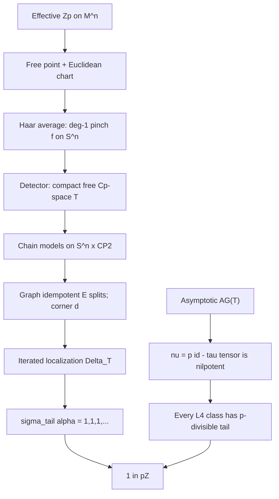

# Proof overview — Dabrowski Hilbert–Smith preprint (2026-10-08)

Answers to reverse-verification questions Q1, Q2, Q4, Q6, applied to A. Dabrowski’s *Integral tail signatures and the Hilbert–Smith conjecture*.
Source: vendored PDF in [`paper/HSproof.pdf`](../paper/HSproof.pdf).

## Statement

**Theorem 1.1 (p-adic exclusion).** For every prime \(p\), a continuous action of \(\mathbb{Z}_p\) on a connected finite-dimensional manifold has nontrivial kernel.

**Corollary 1.2 (Hilbert–Smith).** A second-countable locally compact Hausdorff group acting continuously and effectively on such a manifold is a Lie group with its given topology.

Manifolds are Hausdorff and second countable, and **may have boundary**. All actions are jointly continuous. Corollary 1.2 is the standard reduction: locally compact structure + Newman ([Pa19]) + Theorem 1.1 + Gleason–Yamabe (no small subgroups \(\Rightarrow\) Lie). The Lean `Challenge.lean` states the **boundaryless** form; the paper recovers the boundary case by restricting to the interior (homeomorphisms preserve the interior by local homology).

## Mechanism in one paragraph

Assume an effective \(\mathbb{Z}_p\)-action on a connected \(n\)-manifold, \(n\ge 1\). A free point exists (Lemma 8.1). Center a Euclidean chart; Haar-average coordinates of a small open tail \(H=p^j\mathbb{Z}_p\) to get an invariant degree-one pinch \(f:S^n\to S^n\). A character detector embeds a compact free \(C_p\)-space \(T\) (odd sphere) from the free covering \(Z^+/H'\). On the product Poincaré manifold \(W=S^n\times\mathbb{CP}^2\), shrinking triangulations supply controlled chain models; finite quotients \(G_i=H/K_i\) act up to homotopy. Compression to an exterior band, then a graph idempotent \(E\), splits in Karoubi completion to a Poincaré corner \(d\in L_{n+4}(B_{G,Z}(T\times S^n))\). Forgetting equivariance recovers the scalar germ of \(f\). Iterated Karoubi localization boundaries \(\Delta_T\) cut the sphere down to a point and retain one copy of \(\mathbb{CP}^2\), giving \(\alpha\in L_4(A_G(T))\) with **signature tail constantly \(1\)** (Proposition 13.1). Independently, on any compact free \(C_p\)-space \(T\), tensoring with the positive permutation form \(\tau_i=\mathbb{Q}[G_i/P_i]\) is locally \(p\) copies of the identity; controlled Mayer–Vietoris makes \(\nu=p\cdot\mathrm{id}-\tau\otimes(-)\) **nilpotent**. Equivariant signature characters plus cyclotomic arithmetic force every class in \(L_4(A_G(T))\) to have **eventually \(p\)-divisible ordinary signatures** (Theorem 4.3). Hence \(1\in p\mathbb{Z}\).

## Q1 — Why no p-adic homeomorphisms near id?

Same geometric reason as OpenAI, packaged differently.

1. **Small open tails.** Effectivity plus Roberts’s theorem on pointwise-finite families produce a free point (Lemma 8.1). Joint continuity then supplies \(H=p^j\mathbb{Z}_p\) with arbitrarily small Euclidean displacements on a chart ball. Finer kernels \(K_i=p^{\ell_i}\mathbb{Z}_p\), \(\ell_i\to\infty\), give finite cyclic groups \(G_i=H/K_i\) of unbounded \(p\)-power order.
2. **Averaging near id.** The Haar coordinate average \(F_0(x)=\int_H hx\,d\mu(h)\) is \(H\)-invariant and \(C^0\)-close to the identity on a chart, so the compactified pinch \(f\) has degree one. Finite groups have no smaller open subgroup to average over while keeping degree one.
3. **Arithmetic uses the sequence, not a single cover.** Divisibility is a statement about the **tail** of \(L_4(A_G(T))\): signatures of the coordinate forms \((V_i,b_i)\) are eventually divisible by \(p\). Realization produces the constant tail \(1\). That needs infinitely many finer \(G_i\), which only \(\mathbb{Z}_p\) supplies.

So the disproof is: a faithful action near the identity would manufacture a Poincaré class over a fixed free \(C_p\)-space whose ordinary signatures stay \(1\), while permutation-tensor nilpotence forces those signatures into \(p\mathbb{Z}\).

## Q2 — Geometric or algebraic?

**Mostly algebraic L-theory, with a thin Euclidean shell.**

| Layer | Nature | Content |
|-------|--------|---------|
| Chart / free point / Haar pinch | Geometric | Local Euclidean coordinates, Newman in the corollary, orientation of \(S^n\times\mathbb{CP}^2\) |
| Detector / sheets / triangulations | Topological / PL | Equivariant map \(Z^+\to T=S^{2m-1}\); mesh \(\eta_i\to 0\) chain approximations |
| Duality / corners / localization | Algebraic | Ultimate lower quadratic \(L\)-theory \(L_k=\pi_k L^{\langle-\infty\rangle}\); Karoubi filtrations [CP95]; Ranicki Poincaré pairs [Ran80I, Ran80II]; Balmer–Schlichting splitting [BS01] |
| Contradiction | Arithmetic | Integer signature tail: \(1\in p\mathbb{Z}\) |

The obstruction is **not** Yang/Bredon–Raymond–Williams cohomological-dimension raising. Orbit-space dimension never appears. The invariant that must hold in every Euclidean neighborhood is an **integer signature** realized by \(\mathbb{CP}^2\) after forgetting a controlled equivariant corner.

## Q4 — What the proof says about the structure of \(\mathbb{R}^n\)

Open sets in \(\mathbb{R}^n\) (after compactification to \(S^n\) and product with \(\mathbb{CP}^2\)) carry:

1. **Controlled Poincaré–Lefschetz duality** at shrinking mesh, so algebraic Poincaré pairs exist with propagation \(\to 0\).
2. **A degree-one invariant pinch** after Haar averaging of a small open tail, so the scalar \(L\)-class is the manifold germ of \(S^n\times\mathbb{CP}^2\), not a multiple of \(p\).
3. **No \(p\)-divisible integer signature tail** for that germ after transferring across a free \(C_p\)-space \(T\) built from local sheets.

In slogan form: \(\mathbb{R}^n\) is **signature-tail rigid** under continuous \(p\)-adic orbit quotients. The rigidity is measured in \(L_4(A_G(T))\), not on the possibly wild orbit space.

## Q6 — Is the contradiction “orbit space factoring + wonky local sphere maps”?

**Partly yes, but the wonky maps are controlled chain maps, not sphere maps of unbounded degree.**

- Yes: the degree-one pinch \(f\) is \(H\)-invariant, so it factors through the orbit space of the tail. Finite quotients \(G_i\) act on chain models up to homotopy (graph type).
- The “wonky” part is compression to an exterior band (Lemma 10.1) and a duality-compatible homotopy idempotent \(E\) whose Karoubi corner forgets to \(m_f\).
- The **basic contradiction** is arithmetic on integer signatures:
  \[
  \sigma_{\mathrm{tail}}(\alpha)=[(1,1,1,\ldots)]
  \qquad\text{and}\qquad
  \sigma_{\mathrm{tail}}(\alpha)\in p\mathbb{Z}^{\mathbb{N}}/\mathbb{Z}^{(\mathbb{N})},
  \]
  hence \(1\in p\mathbb{Z}\).

Orbit-space factorization is necessary but not sufficient. The paradox is that factorization plus faithfulness (unbounded \(p\)-power finite quotients) plus Poincaré corners would force an integral class of signature \(1\) to be eventually \(p\)-divisible.

## Section map

| Sections | Role |
|----------|------|
| 1 | Statement; two-part outline; conventions (rational chains, integral \(L\)-groups) |
| 2 | Asymptotic categories \(A_G(X)\); support Karoubi filtrations |
| 3 | Equivariant signatures; Lemma 3.1 (cyclotomic); tail extraction \(\sigma_{\mathrm{tail}}\) |
| 4 | Divisibility: local triviality of \(\tau\), nilpotence of \(\nu\), Theorem 4.3 |
| 5 | Signs; compatible idempotent splitting; scalar normalization |
| 6 | Localization boundaries; union of Poincaré pairs |
| 7 | Acyclic carriers; dual-block Poincaré–Lefschetz at mesh \(\eta\) |
| 8–9 | Geometric data: chart, Haar pinch, detector \(T\), chain models on \(S^n\times\mathbb{CP}^2\) |
| 10–11 | Compression, graph corner, forgetting to \(m_f\) |
| 12 | Iterated boundary evaluation: \(\Delta_1 m_f=\varepsilon[\mathbb{CP}^2]\) |
| 13 | Realization of signature \(1\); proofs of 1.1 and 1.2 |
