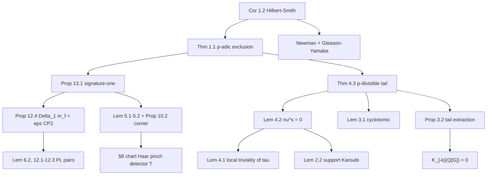

# Lemma dependency ledger (Dabrowski)

Extracted from the vendored PDF `HSproof.pdf` (17 pp.) and sparse Lean headers. There is no public LaTeX tree; labels below are PDF lemma numbers.

## Core dependency chain (contradiction)

## Targeted audit nodes (by Sherlock target)

| Target | PDF objects | Sparse Lean |
|--------|-------------|-------------|
| A | Lem 3.1, Prop 3.2, Thm 4.3, Prop 12.4, Prop 13.1 | `AlgebraicReduction.lean`, `EquivariantSignature.lean`, `HilbertSmithNegK.lean` |
| B | Lem 2.2, 4.1, 4.2; §8 Haar pinch; Lem 5.1–5.2; Prop 10.2 | `ChartData.lean`, `CharacterDetector.lean`, `CornerClass.lean`, `ControlledDuality.lean` |
| C | Challenge/Solution vs Thm 1.1 / Cor 1.2 | `Challenge.lean`, `Solution.lean`, `Statement.lean`, `HilbertSmith*.lean` |
| Sanity | Unbounded \(K_i\); deg-1 Haar | `ChartData.lean` comments on displacement \(D<1/64\) |

## External citations used as black boxes

| Citation | Role in proof |
|----------|---------------|
| [CP95] Carlsson–Pedersen | Karoubi localization, connecting maps, pair description of boundaries |
| [Ran80I], [Ran80II] | Algebraic Poincaré pairs and unions |
| [Ran89], [Ran92] | Additive / lower \(L\)-theory; ultimate decoration; \(L(Q)\cong L(\mathrm{Kar}\,Q)\) |
| [Ran99] | Controlled Poincaré–Lefschetz, dual cells |
| [BS01] Balmer–Schlichting | Idempotent splitting in the bounded derived category of Karoubi completion |
| [Wei13] | \(K_{-k}(\mathbb{Q}[G])=0\) for finite \(G\) |
| [Pa19] Pardon survey | Standard reduction; Uniform Newman |
| [Gle52], [Yam53] | No small subgroups \(\Rightarrow\) Lie |
| [Rob75] | Pointwise finite families \(\Rightarrow\) finite image (free point) |
| [Hat02] | Simplicial approximation; degree classifies maps \(S^n\to S^n\) for \(n\ge 1\) |

## Lean engineering (not in the 17-page PDF)

| Module cluster | Role |
|----------------|------|
| `Inputs/GY`, `Inputs/Lemma7`, `Newman/` | Gleason–Yamabe, Tao 2011 Lemma 7, Newman prime order |
| `LTheory/Model/` including `NegK/High/` | Concrete lower \(L\)-theory; `NegKHighAll` |
| `Brouwer/` | Five MIT-licensed files (upstream README) |
