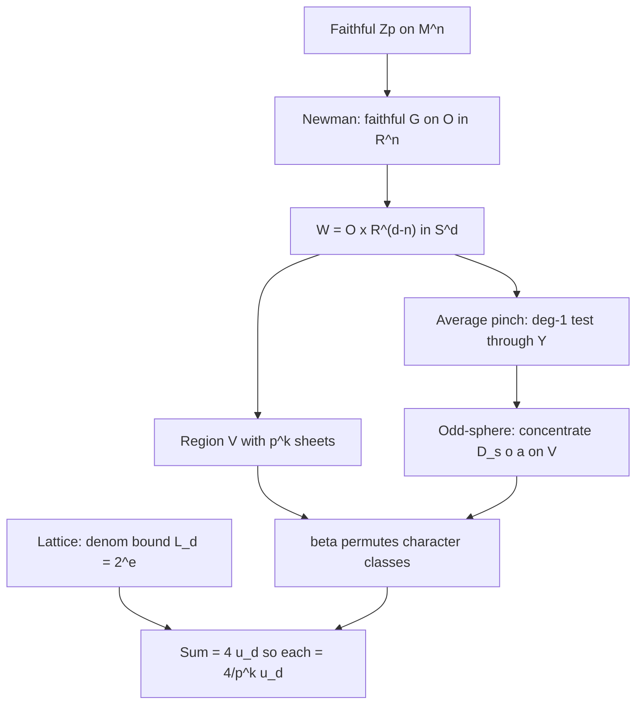

# Proof overview — OpenAI Hilbert–Smith preprint (2026-09-23)

Answers to reverse-verification questions Q1, Q2, Q4, Q6.
Source: vendored LaTeX in [`paper/`](../paper/).

## Statement

**Theorem (Hilbert–Smith, all finite dimensions).** A locally compact second-countable Hausdorff group acting faithfully and jointly continuously on a connected Hausdorff second-countable topological \(n\)-manifold without boundary is a Lie group.

**Reduction.** Classical structure theory ⇒ it suffices to exclude faithful continuous actions of the additive \(p\)-adic integers \(\mathbb{Z}_p\) on such manifolds (`thm:main`).

## Mechanism in one paragraph

Assume a faithful \(\mathbb{Z}_p\)-action on \(M^n\). Newman's theorem produces a small open subgroup \(G\cong\mathbb{Z}_p\) acting faithfully and orientation-preservingly on a connected open chart set \(O\subset\mathbb{R}^n\). Stabilize to odd dimension \(d>n\) by \(W=O\times\mathbb{R}^{d-n}\subset\mathbb{R}^d\subset S^d\). Pass to the one-point compactification \(W^+\) and orbit space \(Y=W^+/G\). Average a degree-one pinch over a sufficiently small open subgroup so a degree-one test \(S^d\to Y\to S^d\) factors through \(Y\). Build an integral Witt invariant \(E_d(S^d)\) of sheaf forms (continuous polyhedral generators). Character projectors on finite partitions of \(p\)-power roots of unity produce \(p^k\) integral classes \(z_i\) that sum to \(4u_d\). Finite quotient sheets plus an odd-sphere concentration homotopy force all rational images \(\overline{z}_i\) equal. Hence each is \((4/p^k)\overline{u}_d\). But a prior comparison with the semialgebraic subcategory shows all integral classes lie in the fixed lattice \(L_d^{-1}\mathbb{Z}\,\overline{u}_d\) with \(L_d=2^{e_d}\) independent of \(k\). Choose \(p^k>4L_d\): contradiction.

## Q1 — Why no p-adic homeomorphisms near id?

The point is not that \(\mathbb{Z}_p\) is “too large,” but that it has **arbitrarily small open subgroups** in the compact-open topology on \(\mathrm{Homeo}(M)\).

1. **Chart reduction** (`prop:chart-reduction`, §5): if every open subgroup fixed a neighborhood of every point, Newman's theorem plus connectedness would force the action trivial, contradicting faithfulness. So some point has no neighborhood fixed by a whole open subgroup; a small open \(G\cong\mathbb{Z}_p\) acts faithfully on an invariant chart open \(O\).
2. **Averaging near id** (`lem:averaged-test`): take a degree-one pinch supported in a ball in \(W\). Because \(G\) is profinite, a small open \(H\subset G\) moves that pinch by Euclidean distance \(<1/2\) uniformly. Haar averaging produces an \(H\)-invariant map still of degree one, which descends through \(Y=W^+/H\).
3. **Finite groups cannot do this:** for a free/near-free \(\mathbb{Z}/p\) action, any invariant map through the orbit space has degree divisible by \(p\) (transfer). So there is no degree-one averaged test. The arithmetic contradiction needs \(p^k>4L_d\); for odd \(p\) even \(k=1\) can suffice, but only after a degree-one (or coprime-to-\(p\)) test exists — which requires a **small** subgroup.

So the disproof is: a faithful action near the identity would manufacture arbitrarily fine equal integral Witt pieces of a fixed orientation class on \(S^d\), contradicting the denominator lattice.

## Q2 — Geometric or algebraic?

**Mostly algebraic-invariant, with a thin geometric shell.**

| Layer | Nature | Content |
|-------|--------|---------|
| Chart / Newman / orientation | Geometric | Local Euclidean charts, orientation preservation |
| Averaging / sheets / odd-sphere | Topological | Haar average, Serre on \(\pi_*(S^{\mathrm{odd}})\), Čech |
| Duality / Witt / lattice | Algebraic | Verdier duality on generated categories; Balmer triangular Witt; integral comparison \(\mathcal{P}\to\mathcal{T}\) |
| Contradiction | Arithmetic | Equal parts vs bounded denominators |

The obstruction is **not** Yang/Bredon–Raymond–Williams cohomological-dimension raising of the orbit space. The paper explicitly avoids any dimension bound on \(Y\). The invariant that must hold in every Euclidean neighborhood is the **integer signature** of a degree-\(d\) form on a small oriented ball (`prop:generic-signature`), transferred to a fixed lattice on \(E_d(S^d)\).

## Q4 — What the proof says about the structure of \(\mathbb{R}^n\)

Open sets in \(\mathbb{R}^n\) (after odd stabilization into \(S^d\)) carry:

1. **Local Poincaré duality** with real coefficients, packaged as Verdier dualizing complexes and orientation forms.
2. **Integral signature** for continuous (not merely PL) proper maps from polyhedra — after comparison with a semialgebraic generating subcategory and a uniform 2-power denominator.
3. **No infinite \(p\)-divisible equal splitting** of that orientation class through a continuous \(\mathbb{Z}_p\)-orbit factorization.

In slogan form: \(\mathbb{R}^n\) (and finite-dimensional topological manifolds) are **signature-rigid** under continuous \(p\)-adic orbit quotients. The rigidity is measured on the ambient sphere, not on the possibly wild orbit space.

## Q6 — Is the contradiction “orbit space factoring + wonky local sphere maps”?

**Partly yes, but the wonky maps are controlled.**

- Yes: the degree-one test **always factors** \(S^d\xrightarrow{c}W^+\xrightarrow{q}Y\xrightarrow{a}S^d\) (`lem:averaged-test`). That is the orbit-space factorization.
- The “wonky” part is concentrating a positive-degree postcomposition into a region with \(p^k\) labeled sheets (`prop:move-test` + `lem:finite-sheets`), then using a character multiplier \(\beta\) to cyclically permute Witt character classes (`prop:equal-parts`).
- The **basic contradiction** is arithmetic on \(S^d\):
  \[
  \sum_{i=0}^{p^k-1}\overline{z}_i(a)=4\overline{u}_d,\qquad
  \overline{z}_i(a)=\frac{4}{p^k}\overline{u}_d\notin L_d^{-1}\mathbb{Z}\,\overline{u}_d
  \]
  for \(p^k>4L_d\).

So: factoring through an orbit space is necessary but not sufficient for the paradox. The paradox is that such a factorization, combined with faithfulness (arbitrarily fine finite sheets) and odd-sphere homotopy, would force unbounded denominators in a group proven to have bounded denominators.

## Section map

| Section | Role |
|---------|------|
| §1 Intro | Statement, predecessors, numerical sketch |
| §2 Categories | \(\mathcal{T}(X)\), \(\mathcal{P}(X)\), duality, homotopy invariance |
| §3 Localization | Germs, Witt localization, dense doubling |
| §4 Lattice | Bounded \(\mathcal{P}\to\mathcal{T}\) comparison; \(L_d\); degree; contractible quotient |
| §5 Local tests | Chart, average, sheets, move test |
| §6 Characters | Projectors, equal parts, contradiction, Lie conclusion |
| App. | Duality signs for cylinder |

## Verdict pointer

Targeted audit grades and sponge stress tests: [`02_audit_ledger.md`](02_audit_ledger.md), [`03_sponge_stress_test.md`](03_sponge_stress_test.md).
