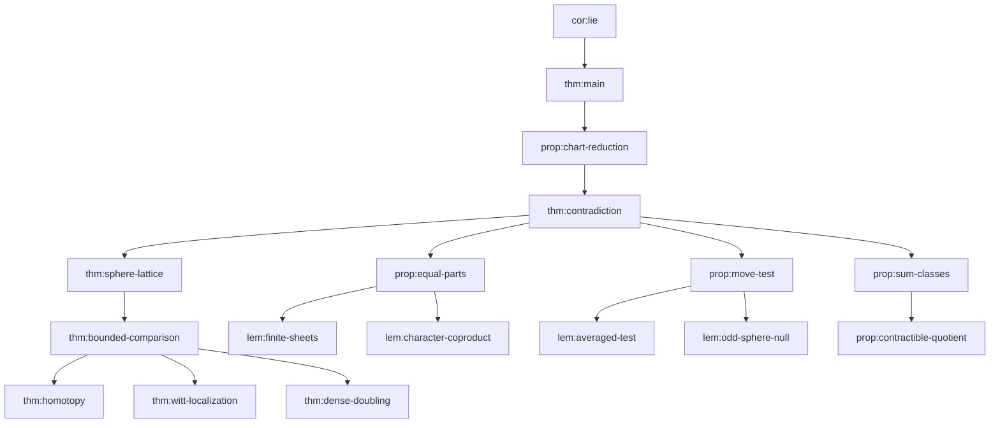

# Lemma dependency ledger

Extracted from vendored LaTeX labels and the proof's load-bearing citations.
File paths are relative to [`paper/`](../paper/).

## Core dependency chain (contradiction)

## Targeted audit nodes (by Sherlock target)

| Target | Labels | Location |
|--------|--------|----------|
| A | `thm:homotopy`, `thm:bounded-comparison`, `prop:sphere-rank`, `thm:sphere-lattice` | `sections/02-categories.tex:701`, `04-lattice.tex:125,203,370` |
| B | `thm:germs`, `thm:witt-localization`, `prop:open-cover`, `thm:dense-doubling`, `prop:contractible-quotient` | `03-localization.tex:165,227,301,344`; `04-lattice.tex:487` |
| C | `lem:character-coproduct`, `lem:orthogonality`, `def:character-classes`, `prop:equal-parts`, `prop:move-test` | `06-character-classes.tex`; `05-local-tests.tex:478` |
| Sanity | `lem:averaged-test` | `05-local-tests.tex:135` |

## External citations used as black boxes

| Citation | Role in proof |
|----------|---------------|
| Newman 1931 / Pardon 2019 | Periodic homeomorphism fixing open set is identity |
| Balmer–Walter 2002, Thm 2.1 | Integral Witt localization sequence |
| Hornbostel–Schlichting 2004, App. A | Cofinality / dense doubling precedent |
| Woolf 2008 | Cylinder homotopy for Witt of sheaves (antecedent) |
| Serre 1951, 1953 | Finiteness of π_j(S^d) (j>d); degree maps kill torsion on odd spheres |
| Hardt 1980 | Semialgebraic triviality for generic signature |
| Stacks Project | Proper base change, soft sheaves, derived sums |
| Pardon 2013 | Classical reduction: non-Lie ⇒ embeds Z_p |

## Full labeled environment inventory

See automated extract in session notes; 45 labeled theorem/lemma/proposition/definition/remark environments across sections 1–6 and the duality-signs appendix.
